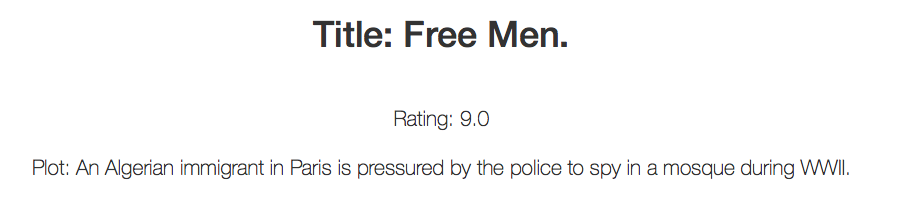

moviesRating
============
A python web app that pulls the current movies on BBC iPlayer (http://www.bbc.co.uk/tv/programmes/formats/films/player/episodes.json or .xml), fetches
ratings for those movies from the Movie database (http://www.themoviedb.org/) and presents it
in a single page app.

## Technologies Used

* Python
* Flask
* Requests
* Json
* HTML5/Css
* Javascript
* Bootstrap
* Jinja2
* MarkupSafe
* Werkzeug
* itsdangerous
* wsgiref
 
## Setup
Install Python, Flask, Requests in your environment following the official guides: 

* [http://www.python.org][1]
* [http://flask.pocoo.org/docs/installation/#installation][2]
* [http://docs.python-requests.org/en/latest/user/install/#install][3]

Once downloaded the moviesRating project, open a terminal window and move to the project folder, then type: 
``` Bash
python moviesRating.py
``` 
You should see the following output:
``` Bash
* Running on http://127.0.0.1:5000/
* Restarting with reloader
``` 
Open a web browser and move to http://127.0.0.1:5000/ to make the app work.

## Content
The project consists in a Python web app which reads the movie titles from the BBC iPlayer Json 
and access the moviesDb fetching the ratings for those movies.


Class:
``` Python
class Dictlist(dict):
``` 
I changed the behavior of dicts, creating a subclass that automatically store duplicated values in lists under the same key.

Method:
``` Python
def movieInfoFinder():
``` 
This method do the work, it fetches the movie titles from the BBC Json and then search for those movies ratings filling up a dict and rendering it back to the html page.
Using requests, you can parse the BBC Json url and obtain the following output: 


``` Python
bbc_url = "http://www.bbc.co.uk/tv/programmes/formats/films/player/episodes.json"
bbc_json_request=requests.get(bbc_url)
bbc_json=bbc_json_request.json()
```    

```
 {'episodes': 
  [
   {'programme': 
     {'has_clips': True, 
      'has_related_links': False, 
      'is_legacy_media': False, 
      'available_until': 2014-02-28T05:39:00Z', 
      'title': The Little Promise', 
      'has_segment_events': False, 
      'media': {'expires': 2014-02-28T05:39:00Z', 
                'availability': 3 days left to watch', 
                'format': video'
              }, 
      'image': {'pid': p01jztkb'
               }, 
      'has_medium_or_long_synopsis': True, 
      'pid': b0371spw', 
      'is_available_mediaset_pc_sd': True, 
      'short_synopsis': 'Jack is embarrassed by his dad who is deaf and signs.', 
      'first_broadcast_date': '2013-07-19T05:30:00+01:00', 
      'ownership': {'service': 
                      {'type': 'tv', 
                       'id': 'bbc_two', 
                       'key': 'bbctwo', 
                       'title': 'BBC Two'
                      }
                   }, 
      'position': None, 
      'duration': 900, 
      'media_type': 'audio_video', 
      'type': episode', 
      'display_titles': {'subtitle': '',
                         'title': 'The Little Promise'
                        }, 
      'actual_start': '2014-02-21T05:40:00Z'
      }
    }
  ], 
  'total': 7, 
  'page': 1, 
  'offset': 0
 }
```
You can now access all the movie infos accessing to this data; for example typing:
``` Python
bbc_json['episodes'][0]['programme']['title']
```
will give you the movie title.
We can then pass the results to the Html page with:

``` Python
return render_template('index.html', rating=rating) 
```
and fetching them from the html page with:

``` html

  <div class="starter-template">
    <h1>Title: <td>{{ movie }}</td>.</h1>
  </div>
    <p class="lead">Rating: {{rating[movie][0]}}</p>
    <p class="lead">Plot: {{rating[movie][1]}}</p>
    <br>
  
     
  
     <br>

```



[1]: http://www.python.org
[2]: http://flask.pocoo.org/docs/installation/#installation
[3]: http://docs.python-requests.org/en/latest/user/install/#install